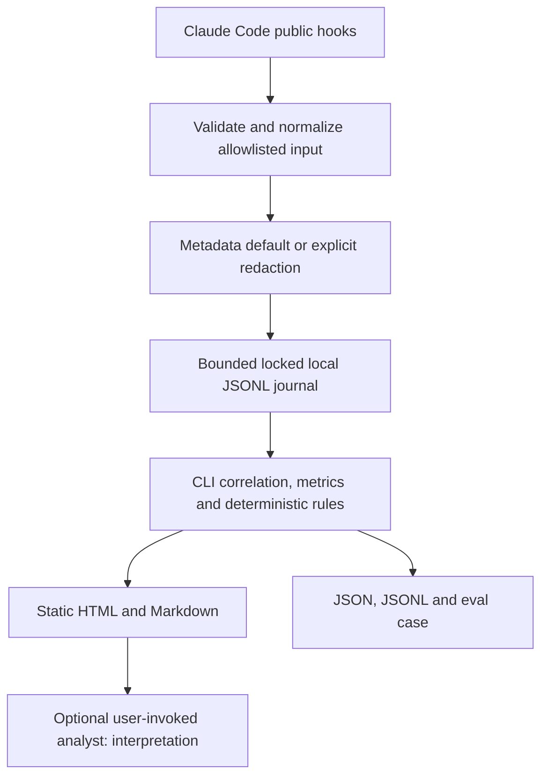

# Architecture

The evidence layer is immutable observed records. Findings cite record sequences.
Interpretation never changes evidence or detector results. There is no MCP server:
MCP exposes tools to the agent, whereas hooks observe a documented lifecycle.

Hooks accept up to 1 MiB, normalize in memory, acquire an exclusive-create session
lock for at most 400 ms, append one JSONL record and `fsync`. Timeout is 5 s in the
plugin. They print no stdout, permissions, injected context or blocking decisions.
On errors they emit a fixed non-secret stderr warning and exit zero. Process
termination/client timeout can still omit events. They do no git scanning, LLM
calls, networking or automatic report generation. Synchronous bounded writes
avoid async teardown losses and preserve the pre-call observation; this adds
measurable latency, documented in the benchmark.

Sequence orders successful writes under the lock, not wall-clock concurrent tool
execution. Correlation uses `(hashed agent_id, hashed tool_use_id)`; no guessed FIFO
pairing is allowed. Out-of-order delivery can pair IDs but cannot invent duration.
`duration_ms` from hooks wins; older clients use the nonnegative receipt interval,
which includes permission/hook overhead and is labeled `observed_interval`.
Duplicate IDs and unpaired calls/results are surfaced separately.

Crash after write but before unlock leaves a stale lock: inspect whether a recorder
is alive before manually removing it. Locks are not automatically stolen. Crash
during append leaves a truncated tail: reports refuse it; explicit `recover`
quarantines the tail and preserves a validated complete prefix. Interior corruption
and unsupported schemas fail loudly. The journal is not tamper-proof.

The neutral schema consists of session/events/tool calls/verification/findings/
metrics. The v1 source is `claude-code`; no adapters claim support for other agents.
Schema major changes require migration. Tool status is hook evidence; final goal
outcome is always unknown without independent ground truth. Workspace metrics are
an explicit, read-only current git snapshot against HEAD, including pre-existing
changes; untracked files are counted separately and line counts exclude them.
